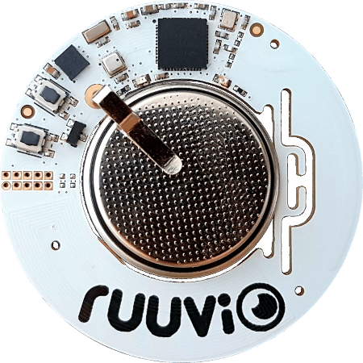

.. _nrf52832_ruuvitagb6:

nRF52832-RUUVITAGB6
##############

Overview
********

The RuuviTag hardware provides
support for the Nordic Semiconductor nRF52832 ARM Cortex-M4F CPU and
the following devices:

* :abbr:`ADC (Analog to Digital Converter)`
* CLOCK
* FLASH
* :abbr:`GPIO (General Purpose Input Output)`
* :abbr:`I2C (Inter-Integrated Circuit)`
* :abbr:`MPU (Memory Protection Unit)`
* :abbr:`NVIC (Nested Vectored Interrupt Controller)`
* :abbr:`PWM (Pulse Width Modulation)`
* RADIO (Bluetooth Low Energy)
* :abbr:`RTC (nRF RTC System Clock)`
* Segger RTT (RTT Console)
* :abbr:`SPI (Serial Peripheral Interface)`
* :abbr:`WDT (Watchdog Timer)`

     RuuviTag

More information about the board can be found at the
`Ruuvi website`_.

Hardware
********

RuuviTag has two external oscillators. The frequency of
the slow clock is 32.768 kHz. The frequency of the main clock
is 32 MHz.

Supported Features
==================

The RuuviTag board configuration supports the following
hardware features:

+-----------+------------+----------------------+
| Interface | Controller | Driver/Component     |
+===========+============+======================+
| ADC       | on-chip    | adc                  |
+-----------+------------+----------------------+
| CLOCK     | on-chip    | clock_control        |
+-----------+------------+----------------------+
| FLASH     | on-chip    | flash                |
+-----------+------------+----------------------+
| GPIO      | on-chip    | gpio                 |
+-----------+------------+----------------------+
| I2C(M)    | on-chip    | i2c                  |
+-----------+------------+----------------------+
| MPU       | on-chip    | arch/arm             |
+-----------+------------+----------------------+
| NVIC      | on-chip    | arch/arm             |
+-----------+------------+----------------------+
| PWM       | on-chip    | pwm                  |
+-----------+------------+----------------------+
| RADIO     | on-chip    | Bluetooth            |
+-----------+------------+----------------------+
| RTC       | on-chip    | system clock         |
+-----------+------------+----------------------+
| RTT       | Segger     | console              |
+-----------+------------+----------------------+
| SPI(M/S)  | on-chip    | spi                  |
+-----------+------------+----------------------+
| WDT       | on-chip    | watchdog             |
+-----------+------------+----------------------+

Other hardware features are not supported by the Zephyr kernel.
See `nRF52 DK website`_ and `Nordic Semiconductor Documentation library`_
for a complete list of nRF52832 hardware features.

Connections and IOs
===================

LED
---

* LED1 (red) = P0.17
* LED2 (green) = P0.19

Push buttons
------------

* BUTTON1 = B = P0.13
* BOOT = R = boot/reset

External Connectors
-------------------

Debug IN

+-------+--------------+-------------------------+
| PIN # | Signal Name  | NRF52832 Functions      |
+=======+==============+=========================+
| 1     | VDD          | N/A                     |
+-------+--------------+-------------------------+
| 2     | SWDIO        | SWDIO                   |
+-------+--------------+-------------------------+
| 3     | P0.21        | P0.21 / RESET           |
+-------+--------------+-------------------------+
| 4     | SWDCLK       | SWDCLK                  |
+-------+--------------+-------------------------+
| 5     | GND          | N/A                     |
+-------+--------------+-------------------------+
| 6     | P0.18        | P0.18 / TRACEDATA[0] /  |
|       |              | SWO                     |
+-------+--------------+-------------------------+

Programming and Debugging
*************************

Flashing
========

Install Nordic semiconductor variant of Segger embedded studio and flash a program compiled with SES.

Debugging
=========

Debug with SES. 

Testing the LEDs and buttons in the nRF52 DK
********************************************

There are 2 samples that allow you to test that the buttons (switches) and LEDs on
the board are working properly with Zephyr:

.. code-block:: console

   samples/basic/blinky
   samples/basic/button

You can build and flash the examples to make sure Zephyr is running correctly on
your board. The button and LED definitions can be found in
:zephyr_file:`boards/arm/nrf52832_ruuvitagb6/nrf52832_ruuvitagb6.dts`.

References
**********

.. target-notes::

.. _Ruuvi website: https://ruuvi.com
.. _nRF52 DK website: https://www.nordicsemi.com/Software-and-Tools/Development-Kits/nRF52-DK
.. _Nordic Semiconductor Documentation library: https://www.nordicsemi.com/DocLib

